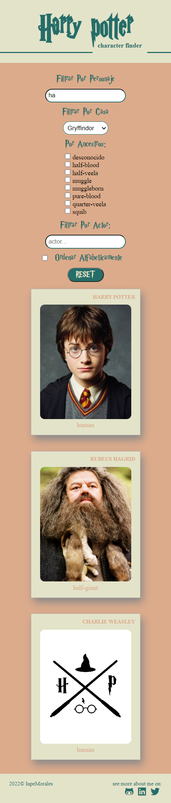
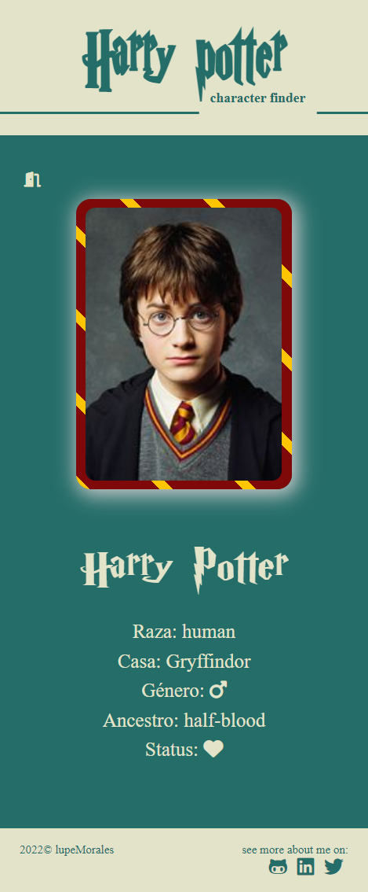
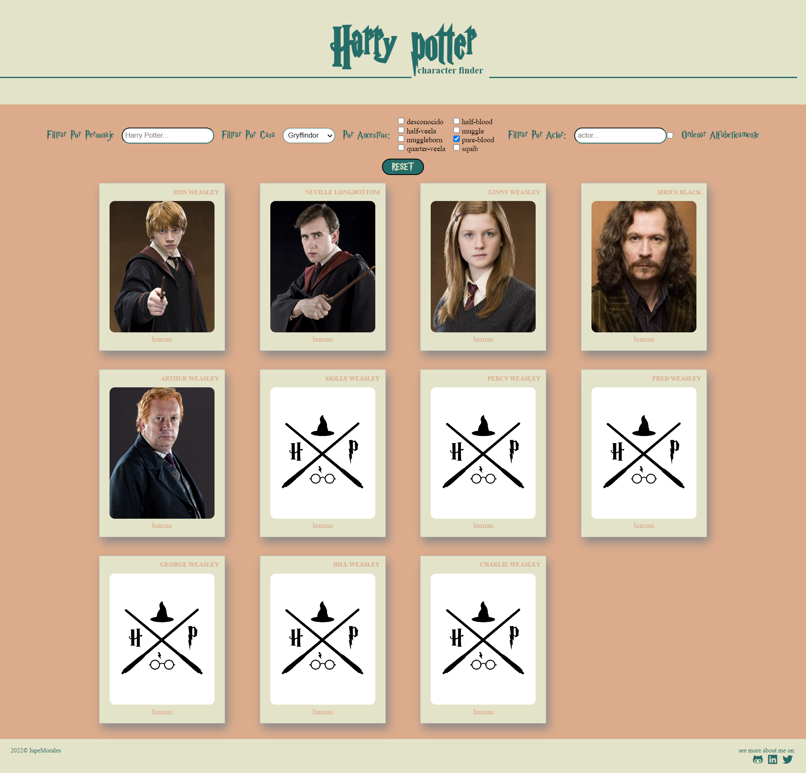

# HARRY POTTER character finder <span> | </span>  <a href="https://lupemorales.github.io/Harry-Potter-character-finder/" target="_blank">   Demo </a><span> | </span>


HARRY POTTER character finder es un buscador web de personajes de Harry Potter. Puedes filtrar la búsqueda según distintos criterios. Además al clickar sobre un personaje se despliegan más detalles del mismo.  

Se trata de un diseño responseve que puede ser utilizado en cualquier dispositivo.

Está realizada usando React

### Web responsive mobile:




### Web responsive mobile detalles:



### Web responsive desktop:




## Tecnologías o lenguajes utilizados
- React
- HTML5
- SCSS
- Javascript
- NPM

## Para ejecutar el programa en tu ordenador

Necesitas tener instalado: 
- Node
- npm
- Gulp

Una vez todo instalado, es importante **arrancar el proyecto**, para ello tienes que ejecutar los siguientes comandos en la terminal:

1. ```bash
   npm install
   ```
2. ```bash
   npm start
   ```
## Recursos

 <p><a href="https://hp-api.herokuapp.com/" target="_blank"> HP-API</a> abierto para la búsqueda de información sobre personajes de Harry Potter </p>

## Contacto

- GitHub [@lupeMorales](https://github.com/lupeMorales )
- Linkedin [@GuadalupeMoralesCarmona](https://linkedin.com/in/guadalupe-morales-carmona-817245226/ )
